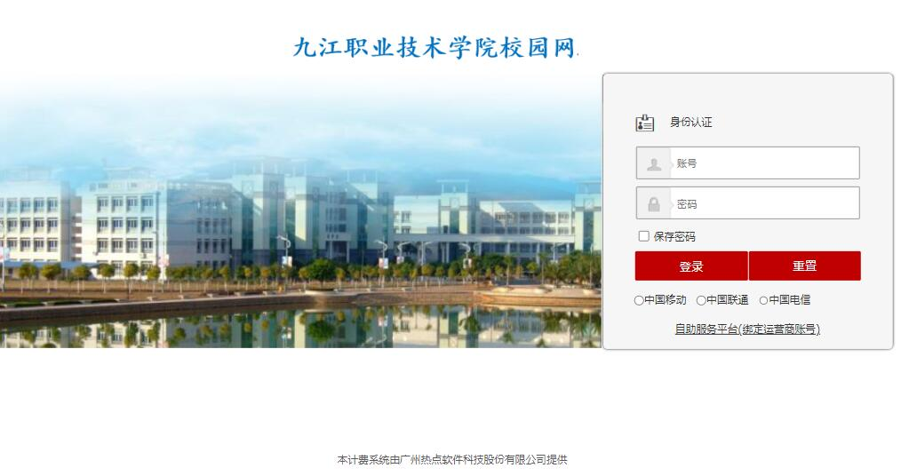

# JvtcCampusNetworkDialer

九江职业技术学院（濂溪校区）校园网拨号器。

## 链接

- [](http://10.31.0.10/a79.htm)
- [](http://10.31.0.11:8080/Self)

## 开始之前

先扫下面二维码，或访问 <https://qr06.cn/Bi3UJ4> **配置好校园网账号**。


## 校园网可用时段

|  星期  |  一  |  二  |   三    |  四   |  五  |   六   |  日   |
|:----:|:---:|:---:|:------:|:----:|:---:|:-----:|:----:|
| 断网时间 | 不断网 | 不断网 |  24 点  | 23 点 | 不断网 | 24 点  | 23 点 |
| 来网时间 |     |     | 次日 7 点 | 24 点 |     | 次日 7点 | 24点  |

上表中标注的“**不断网**”实际上需要重新到认证页面登录一下才能用。

上表中标注的时间会有 ±8 分钟左右的误差，通常是提早断网。

## 原理

本质上是向认证服务器发一条 `GET` 请求：

```http request
GET http://10.31.0.10:801/eportal/portal/login?user_account=000000000@telecom&user_password=000000
```
```text
           --------------                                   -------------------               ------
            ↑认证服务器↑                                       ↑账号↑                           ↑密码↑
```

账号由 **学号** 与运营商代码组成。

- 电信为：`@telecom`
- 联通为：`@unicom`
- 移动为：`@cmcc`

> tips: `@` 在 URL 中会被转义成 `%40`
