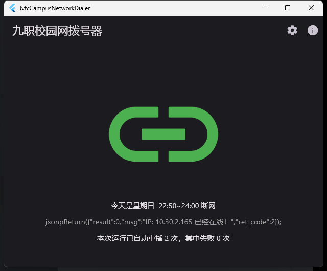

# JvtcCampusNetworkDialer

九江职业技术学院（濂溪校区）校园网拨号器。

## 校园网内链接

- [](http://10.31.0.10/a79.htm)
- [](http://10.31.0.11:8080/Self)

## 开始之前

先扫下面二维码，或访问 <https://qr06.cn/Bi3UJ4> **配置好校园网账号**。


## 校园网可用时段

|  星期  |  一  |  二  |    三    |   四   |  五  |    六    |   日   |
|:----:|:---:|:---:|:-------:|:-----:|:---:|:-------:|:-----:|
| 断网时间 | 不断网 | 不断网 |  23:50  | 22:50 | 不断网 |  23:50  | 22:50 |
| 来网时间 |     |     | 次日 7:00 | 24:00 |     | 次日 7:00 | 24:00 |

上表中标注的“**不断网**”可能在 24 点时要重新到认证页面登录一下才能用。

上表中标注的断网时间通常会有 ±3 分钟的误差。

## 原理

本质上是向认证服务器发一条 `GET` 请求：

```text
GET http://10.31.0.10:801/eportal/portal/login?user_account=000000000@telecom&user_password=000000
           --------------                                   -----------------               ------
            ↑认证服务器↑                                       ↑账号↑                        ↑密码↑
```

账号由 **学号** 与 **运营商代码** 组成。

- 电信为：`@telecom`
- 联通为：`@unicom`
- 移动为：`@cmcc`

> tips: `@` 在 URL 中会被转义成 `%40`

## 使用

### 自动脚本

本项目 `shell/` 目录下已提供，请打开按照注释编辑账号信息。
可配合系统的计划任务自动登入。

### APP



使用 [Flutter](https://flutter.cn/docs/get-started/install) 开发，已经支持 Windows 与 Android。

请前往 [Releases](https://github.com/Yue-plus/JvtcCampusNetworkDialer/releases)
页面下载最新版本使用，遇到任何问题请到 [Issues](https://github.com/Yue-plus/JvtcCampusNetworkDialer/issues/new)
发送反馈。
